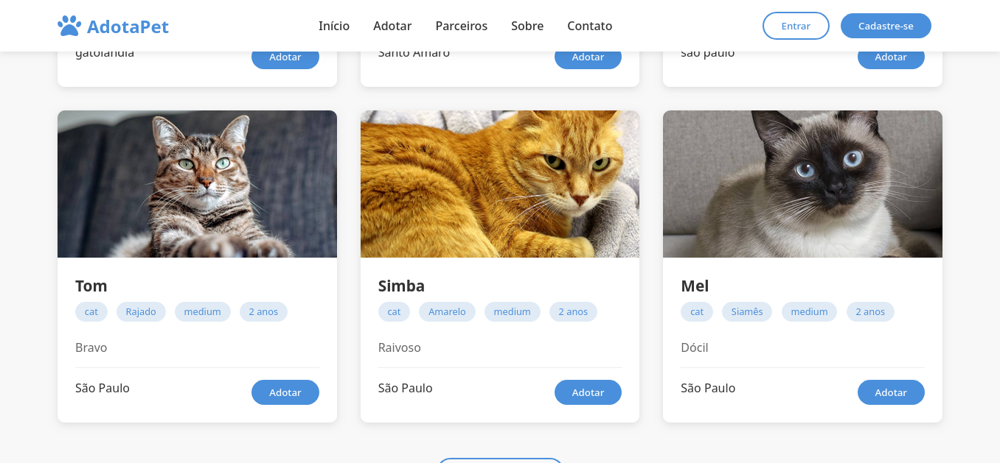

# adotaPet

### Website para resgate e adoção de animais

# Tutorial
 1. Clonar o projeto
 2. Fazer login no MySQL
```bash
mysql -u root -p
```
3. Criar o database 
```sql
CREATE DATABASE adocao_site;
exit;
```
4. Fazer import do banco de dados
```bash
mysql -u seu_nome_de_usuario -p adocao_site < data-dump.sql
```
5. Adicionar sua senha do mysql ao arquivo server.js
6. Entrar no diretório
```bash
cd adotaPet
```
7. Rodar o projeto
```bash
npm start
```
